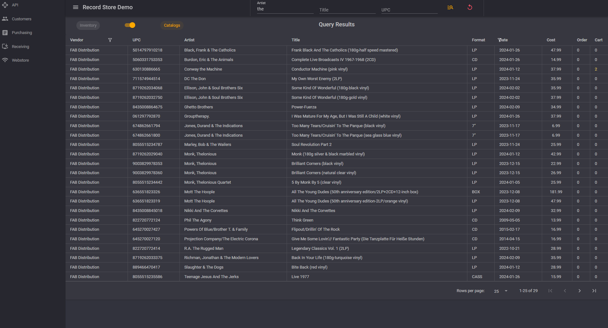
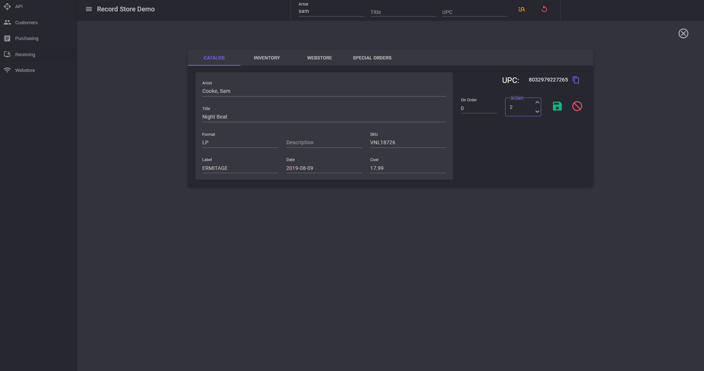
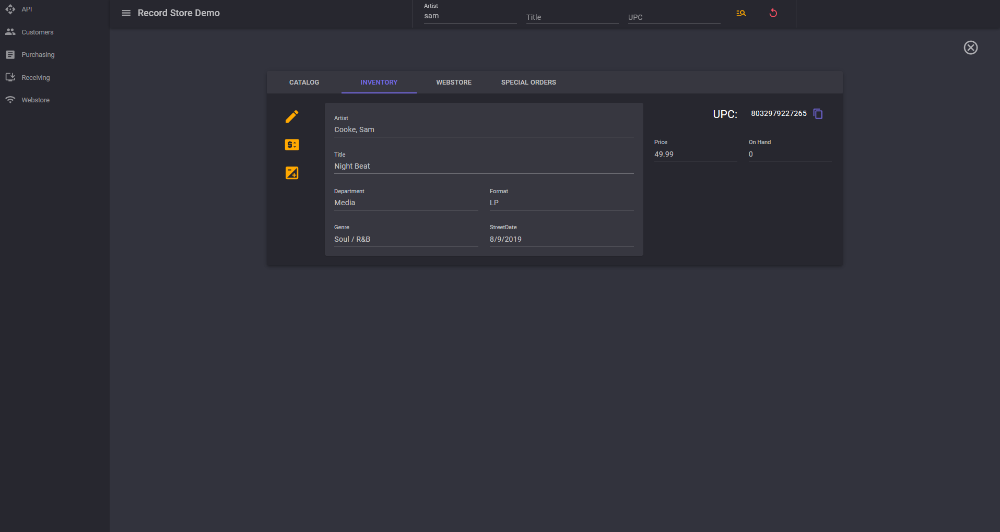
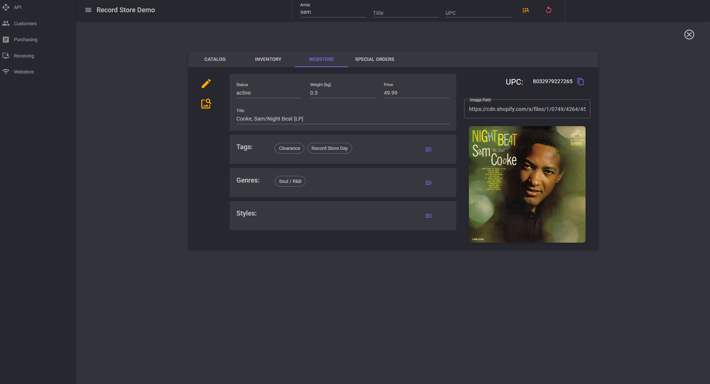
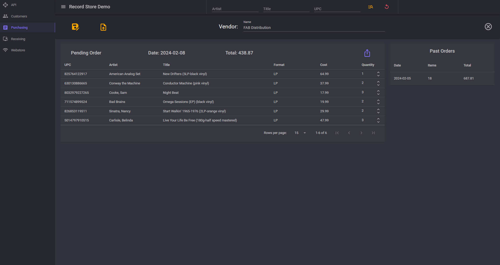
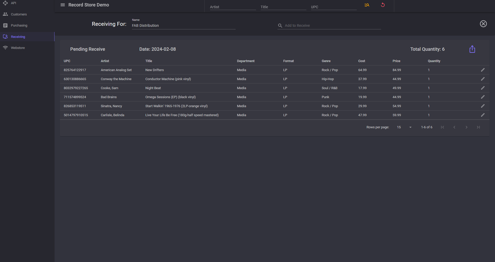
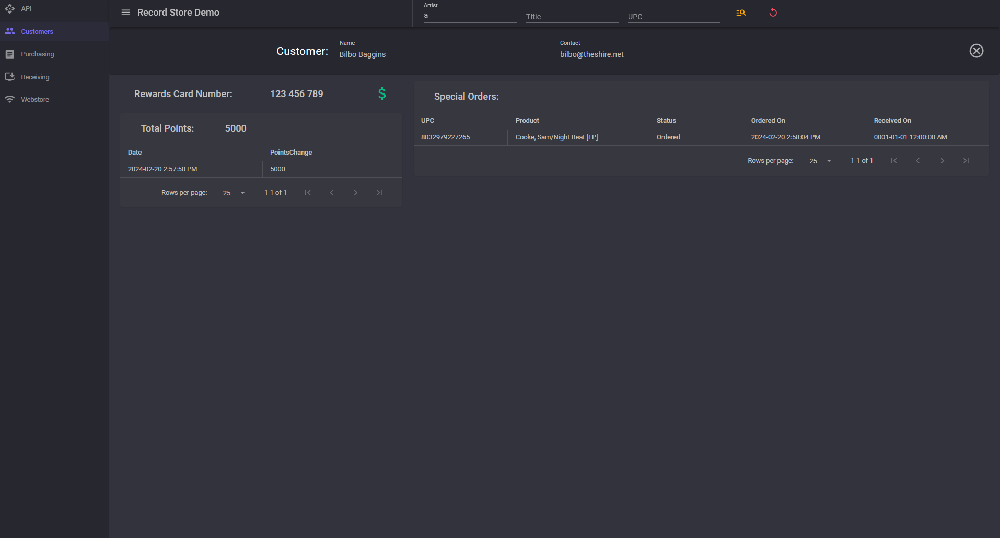

# RecordStoreDemo

A demo Blazor Server application developed with several features necessary for the operation of a Record Store.

## Features
  - Import .csv Catalog Files provided by Vendors.
  - Query the Database for Products, separated into Catalog and Inventory.
  - Create and Submit Purchase Orders for Catalog Products.
  - Receive Products into Inventory.
  - Update Product Metadata such as Format, Genre, Style, and Tags.
  - Adjust Prices and Inventory levels, and view history of these changes.
  - Create Customer Profiles to track Special Orders and Rewards Points.
  - Query public APIs to find cover art for music releases.
  - Upload Products to a Shopify Web Store.
    
## Skills Demonstrated
  - Azure Key Vault - API Keys and Secrets stored in Azure Key Vault.
  - Azure Storage Containers - Catalog Files uploaded to and retreived from Azure Storage Blob.
  - Domain Driven Design - Business Logic contained to methods within Domain Entities retrieved via Repository.
  - Entity Framework & SQL Server - Code-first Database design, simple Repository Pattern to reduce repetitive code.
  - Files - Read and Write .csv files using the CSVHelper Library.
  - Front-End Design - Utilized the MudBlazor Component Library for a clean and responsive user interface.
  - Validation - Data Annotations and Blazor EditForm ensure validation errors are caught and displayed to the user.
  - Web API - Data Access behind API Endpoints for separation of concerns and possibilty of interfacing with other applications or services
  - xUnit - Unit Tests to ensure business logic functions correctly.

## Third-Party NuGet Packages Used
  - [Ardalis.Endpoints](https://github.com/ardalis/ApiEndpoints)
  - [Ardalis.GuardClauses](https://github.com/ardalis/GuardClauses)
  - [CSVHelper](https://joshclose.github.io/CsvHelper/)
  - [HtmlAgilityPack](https://html-agility-pack.net/)
  - [Inflatable.Lastfm](https://github.com/inflatablefriends/lastfm)
  - [MetaBrainz.MusicBrainz](https://github.com/Zastai/MetaBrainz.MusicBrainz)
  - [MudBlazor](https://mudblazor.com/)
  - [ParkSquare.Discogs](https://www.parksq.co.uk/dotnet-core/discogs-csharp)
  - [ShopifySharp](https://github.com/nozzlegear/shopifysharp)

## Screenshots
  Product: Query:
  
  Catalog Product:
  
  Inventory Product:
  
  Webstore Product:
  
  Purchase Order:
  
  Receiving:
  
  Customer Profile:
  
